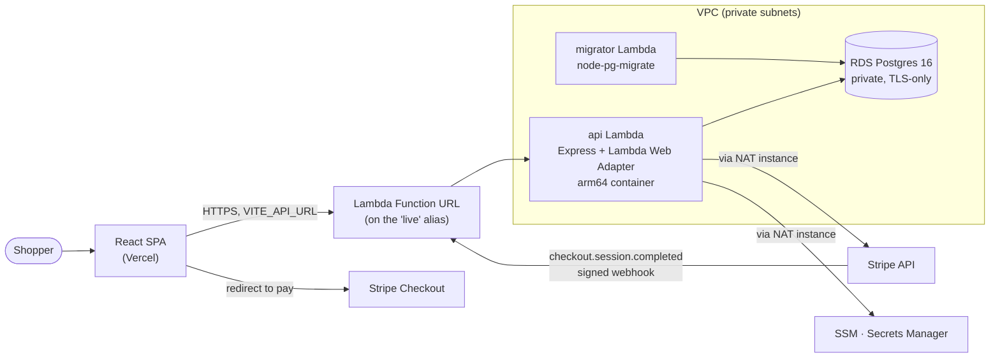
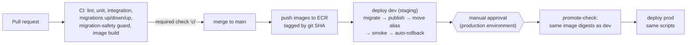

# Dejavu

A full-stack e-commerce storefront for the luxury fashion brand "Vuja-de",
built as a portfolio project. Shoppers browse, add items to a cart and pay
through Stripe Checkout. Admins manage products, stock and orders.

The storefront is the easy part. Most of the work is the engineering around
it:
- **Correctness:** a webhook that records every paid order exactly once and
  never oversells.
- **Proof:** tests against a real Postgres, checked by breaking the code they
  guard.
- **Delivery:** infrastructure as code, and a CD pipeline that deploys to
  staging, gates prod behind a human, and rolls itself back on a failed smoke
  test.

The filter throughout, from [`dejavu-mvp-roadmap.md`](dejavu-mvp-roadmap.md),
is that every decision should hold up to fifteen minutes of questioning.
Anything justified only by "scale" was cut, because this store has no
traffic.

## Where things stand (2026-09-24)

| Phase | What | State |
|---|---|---|
| 0–1 | Secret hygiene, test harness, CI gate | Done |
| 2 | Supabase → plain Postgres, versioned migrations | Done |
| 3 | Correctness fixes: transactional webhook, atomic stock | Done |
| 4 | Integration tests against real Postgres in CI | Done; browser E2E deferred |
| 5 | Terraform, GitHub OIDC, SSM-backed secrets | Done |
| 6 | Backend on Lambda + RDS in **dev**, verified live | Done |
| 7 | Dev (staging) → prod CD with automatic rollback | **Code merged, not yet run against AWS.** Prod isn't stood up. |

Phase 7's remaining steps touch live AWS, GitHub, Stripe and Vercel, so a
human runs them. They're tracked as `needs-human` issues and scripted in
[`phase-7-runbook.md`](phase-7-runbook.md). Nothing below describes the
pipeline as proven live until that runbook's checkpoint drill has run.

## Architecture



- **Frontend** ([`dejavu/`](dejavu/)): React 19 + Vite. The single-page app
  is hosted on Vercel, and all global state lives in `App.jsx`.
- **Backend** ([`backend/`](backend/)): an Express REST API run unchanged on
  Lambda through the Lambda Web Adapter. One Dockerfile builds two targets,
  the `api` image and a `migrator` image.
- **Database:** Postgres 16. It's `docker compose` locally and a private RDS
  instance when deployed. Schema changes are plain-SQL migrations run by
  `node-pg-migrate`. The data layer is a single `pg.Pool` plus repositories;
  there's no ORM.
- **Secrets:** SSM Parameter Store and the RDS-managed master secret, loaded
  at cold start. No secret is set in a Lambda environment variable or written
  in a `.tf` file. The database password rotates weekly without a redeploy.
- **Infrastructure:** Terraform in [`terraform/`](terraform/). There's one
  `bootstrap/` config, applied by a human, plus `envs/dev` and `envs/prod`,
  applied by CI through GitHub OIDC roles. No AWS keys live in the repo.

### How a change ships



- **Deploys are Lambda alias shifts.** [`scripts/deploy/`](scripts/deploy/)
  publishes a version, points `live` at it, and runs `smoke.sh`. There are
  three checks under a hard 15 s budget. If any fails, the alias goes back to
  the previous version, and the rollback is smoke-tested too.
- **Migrations run before code.** They must therefore be safe for the release
  still running in prod: "expand/contract" changes, one step per deploy. A CI
  guard flags destructive statements and edits to already-applied migrations.
  See [`backend/MIGRATIONS.md`](backend/MIGRATIONS.md).
- **Only code auto-promotes, never infrastructure.** Terraform plans are
  posted on PRs and dev applies on merge. Prod's apply runs only when
  dispatched by hand.
- **Alarms go to email through SNS:** 5xx and errors on the live alias,
  throttles, migrator errors, and a `checkout.oversell` log-metric alarm.

## Correctness claims, and the tests behind them

| Claim | How | Proven by |
|---|---|---|
| A webhook delivered twice, or concurrently, creates one order | The Stripe event id is claimed with `INSERT … ON CONFLICT DO NOTHING` in the same transaction as the order ([`stripeEventRepo.js`](backend/src/repositories/stripeEventRepo.js)) | [`concurrency.test.js`](backend/tests/integration/concurrency.test.js) drives two real connections into the race. [`webhook.test.js`](backend/tests/integration/webhook.test.js) covers replay. |
| Stock never goes negative | `UPDATE … SET stock = stock - $n WHERE stock >= $n` ([`variantRepo.js`](backend/src/repositories/variantRepo.js)) | `concurrency.test.js` and `webhook.test.js` ("overselling") |
| A failed webhook is retryable, a deterministic one isn't | 500 only for failures a retry can fix. Duplicates and oversells return 200 and are logged for a human. | `webhook.test.js` |
| Guest orders can't be taken over by knowing an email | Orders are claimed with the buyer's own `stripeSessionId` (`POST /api/user/orders/claim`), not linked by email at registration | [`orders.test.js`](backend/tests/integration/orders.test.js) |
| The API response shapes the frontend relies on don't drift | Repositories rebuild the nested JSON the old PostgREST layer returned. The key names are recorded in [`tests/fixtures/apiShapes.js`](backend/tests/fixtures/apiShapes.js). | [`catalog.test.js`](backend/tests/integration/catalog.test.js) ("nests variants under the PostgREST key name", "nests User and OrderItem the way the dashboard reads them") |

**Mutation check, re-run 2026-09-24** against real Postgres 16 on Node 22.
Each guarantee was broken on purpose, then the suite was run:

| Code reverted to | Full suite |
|---|---|
| Event claim as a read-then-write | 1 failure: `concurrency.test.js`'s race test |
| Stock update as a read-modify-write | 4 failures: 2 in `concurrency.test.js`, 2 in `webhook.test.js` |

One caveat. With the event claim broken, `webhook.test.js`'s "two concurrent
deliveries" test **still passes when its file runs as a whole**, three runs
out of three. It fails only when run on its own. The guarantee is held by
`concurrency.test.js`, not by that test. The execution plan's older claim
that it failed "exactly the two idempotency tests" was overstated, and has
been corrected. Fixing the test is tracked in [#40](https://github.com/Ayprusss/dejavu/issues/40).

## Run it locally

You need Node ≥ 20 (`.nvmrc` pins 22), Docker, and optionally the Stripe CLI
for checkout.

```bash
git clone https://github.com/Ayprusss/dejavu.git && cd dejavu
docker compose up -d db                 # Postgres 16 on :5432

cd backend
cp .env.example .env                    # set JWT_SECRET and Stripe test keys
npm ci
npm run migrate:up
npm run seed                            # truncates, then loads demo products
npm run dev                             # API on http://localhost:5000

# second terminal
cd dejavu && npm ci && npm run dev      # storefront on http://localhost:5173

# third terminal, to complete a test checkout
stripe listen --forward-to localhost:5000/api/webhooks/stripe
# paste the printed whsec_… into backend/.env as STRIPE_WEBHOOK_SECRET
```

To run the API and a built storefront in containers instead, use
`docker compose up`: the storefront is served on :5173 and the API on :5000.
Its `backend` service reads `JWT_SECRET` and the Stripe keys from your shell
or a root `.env`. It doesn't migrate or seed, so run those from `backend/`
first.

## Tests

Counts as of 2026-09-24:

| Suite | Command | Needs | Count |
|---|---|---|---|
| Backend unit | `npm test` in `backend/` | nothing | 101 |
| Backend integration | `npm run test:integration` in `backend/` | local Postgres, whose tables it **truncates** | 53 |
| Frontend unit | `npm test` in `dejavu/` | nothing | 55 |
| Deploy scripts | `bash scripts/deploy/test/run.sh` | `jq` (it fakes `aws` and `curl`) | 70 |

The integration tests' setup refuses any database host that isn't local. CI
runs all four suites, plus lint, a Prettier check, `shellcheck`, a boot check
that the app refuses to start without `JWT_SECRET`, and migrations up → down
→ up. The integration suite runs against a Postgres service container.

## Cost

With dev up it's about $25–26/month at list price, and about $50 with both
environments up. The resting state, both torn down, is about $0.20/month. So
far this account has paid $0: the free tier and credits cover it. Measured
numbers and the reasoning are in
[`dejavu-execution-plan.md`](dejavu-execution-plan.md#cost).

## Known limitations

Deferred on purpose, with the reasons in the linked docs:

- **No browser E2E tests (Playwright).** Deferred in Phase 4; the API-level
  integration suite carries the correctness claims.
- **No backward-compatibility CI job** that runs `main`'s tests against a
  PR's schema. The expand/contract rule and the migration guard stand in for
  it ([`backend/MIGRATIONS.md`](backend/MIGRATIONS.md)).
- **Rate limits are in memory, per Lambda environment.** There's no shared
  store or WAF.
- **Login timing reveals whether an email is registered.** An unknown email
  returns 401 before bcrypt runs.
- **The app connects as the RDS master user.** There's no least-privilege
  `dejavu_app` role yet.
- **SSM secret values are still in Terraform state.** They'd leave it once
  the provider's `value_wo` is adopted.
- **A static admin key**, not IAM Identity Center, is used for the
  human-applied steps.
- **One narrow password-rotation gap.** A request that lands while a rotation
  is mid-flight can still fail once. The connection retry covers the
  stale-cache case, not that one.
- **`webhook.test.js`'s concurrent-delivery test** doesn't catch a broken
  event claim when run with its file. See the mutation check above and
  [#40](https://github.com/Ayprusss/dejavu/issues/40).
- **No UI for claiming a guest order.** `POST /api/user/orders/claim` exists
  and is tested, but the storefront doesn't call it yet.

## Where to read more

| Doc | For |
|---|---|
| [`CLAUDE.md`](CLAUDE.md) | Architecture and conventions reference: routes, middleware order, data layer, deployment |
| [`dejavu-mvp-roadmap.md`](dejavu-mvp-roadmap.md) | What was in scope, what was cut, and why |
| [`dejavu-execution-plan.md`](dejavu-execution-plan.md) | Phase-by-phase plan, "what actually turned up", verification table, cost |
| [`phase-6-steps.md`](phase-6-steps.md), [`phase-7-steps.md`](phase-7-steps.md) | The Lambda/RDS deploy and the CD pipeline, step by step |
| [`phase-7-runbook.md`](phase-7-runbook.md) | The remaining live steps, in order |
| [`terraform/README.md`](terraform/README.md) | First deploy, teardown and re-create, rotation, PITR restore |
| [`backend/README.md`](backend/README.md), [`dejavu/README.md`](dejavu/README.md) | Per-workspace setup and reference |
